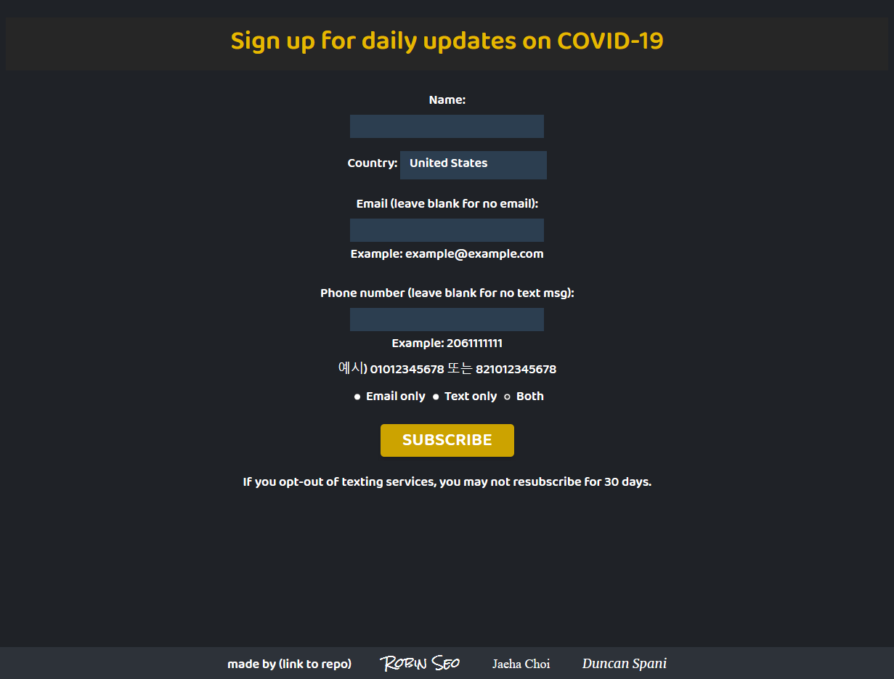

# Covid 19 SMS/Email Notification —— [UWB Hacks the Cloud 2020](https://uwbhacks.com/)

> ## A fully automated notification server for COVID-19 data

## Goals: 
The goals of this project were for us to gain knowledge in the cloud while providing a relevant and useful service.\
We wanted to provide current information on the growing epidemic and every once a day, showed official information through the easy and simple notifications emails or/and text messages so people can acknowledge the danger that is the coronavirus.

## Desired User Experience:
The desired user experience was to be simple for the user to subscribe and simple for the user to unsubscribe.
The user would simply go to the website [covnews.org](https://covnews.org/), fill in the fields and (if applicable) confirm their email subscrition.\
From that point on the user would not have to worry about anything unless they want to unsubscribe.\
The user will then begin recieving daily updates for their desired country (currently only US and South Korea) containing the following criteria: 

>* Country
>* Confirmed cases
>* Total deaths
>* Total recovered
>* Data date

## Implementation Details:

[Coronavirus COVID19 API](https://documenter.getpostman.com/view/10808728/SzS8rjbc?version=latest#b07f97ba-24f4-4ebe-ad71-97fa35f3b683) to retrieve data about COVID-19.

[AWS Simple Notification Service (SNS)](https://aws.amazon.com/sns/?whats-new-cards.sort-by=item.additionalFields.postDateTime&whats-new-cards.sort-order=desc) was used to users subscribe to a "Topic" that we created. At certain time, users get notified for the topic they subscribed. In this project, topics are COVID-19 data for each country.

[Digital Ocean](https://cloud.digitalocean.com) was used to create a multi-purpose server. Nginx was installed to create and operate the webserver, and our python script that uses boto3 allows us to use AWS SNS. By using cron, we were able to create fully automated notification server for COVID-19 data. 

[Let's encrypt](https://letsencrypt.org/) certificate for HTTPS protocol. Certbot was used to create certificates.

Domain purchased from [Google Domains](https://domains.google.com/), but we use nameservers from Digital Ocean.

The website offers daily coronavirus updates at 12:00 PM through either email, sms messaging, or both. Upon subscribing, the user will receive a confirmation text saying they are subscribed, and a confirmaiton email containing a link in which they can confirm their subscription. Our notification server will then publish the information to the subscibers everyday at the same time.

### Dependencies:
> - **php7.2-fpm**: Code execution (Front-end) 
> - **python3**: Main programming language used. (<3.8)
> - **python3-boto3**: For AWS SNS (this allows users to subscribe our "Topic", and it also allows us to publish to subscribers)
> - **python3-requests**: For requesting API
> - **cron**: For schedueled task
> - **certbot**: For HTTPS certificate
> - **nginx**: Web server

## Issues Encountered: 
- Programming languages: We had not worked a lot with Python before and none of us had worked with HTML, CSS, or PHP before this project so learning the languages in a timecrunch was an issue we encountered. 

    - Learning the boto3 syntax: the boto3 syntax was hard to follow and at the beginning the documentation did not help us too much.

- Package not being recognized: We had an issue with boto3 not being reconized in the server, if executed with non-user account. The issue was that package was installed locally, so that it was not accessible by other users.

- Establishing connections between modules: Connecting the front-end to the back-end scripts to send confirmation emails took a lot of time, mostly because of parsing and passing parameters.

- Building the Website From Scratch: Since none of us had any experience working with HTML, CSS, and PHP, we had to learn all the languages from scratch and in a timecrunch to make sure we could test it. building the website and connecting it to the backend was probably the largest challenge.

- Creating the Crontab Script: the crontab script took some time to create, we had no idea how to use crontab so we had to take some time to learn how to set it up and the syntax behnd it.

## Future Work:
- Add support for mopre countries.
- Add state option (for certain countries only). 
- Add more languages in the website.

## Contributors:
- [Jaeha Choi](https://git.jaeha.dev/Jaeha.Choi)
- [Robin Seo](https://github.com/seo-chang)
- [Duncan Spani](https://github.com/dspani)
